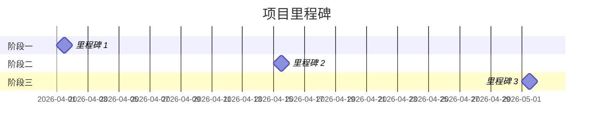

# {汇报主题}

> 汇报类型：{立项汇报 | 进度汇报 | 结果汇报} | {DATE}

---

## 1. 核心结论（1 页）

| 项目 | 内容 |
|------|------|
| **一句话总结** | {核心结论/价值主张} |
| **关键数据/收益** | {3 个核心指标或收益点} |

---

## 2. 背景与问题（1-2 页）

### 2.1 现状痛点

- {痛点 1：描述 + 数据支撑}
- {痛点 2：描述 + 数据支撑}
- {痛点 3：描述 + 数据支撑}

### 2.2 为什么现在做

| 驱动因素 | 说明 |
|---------|------|
| **市场趋势** | {市场变化/机会窗口} |
| **用户需求** | {用户需求变化/增长} |
| **竞争态势** | {竞争对手动作/差异化机会} |
| **内部驱动** | {业务目标/战略对齐} |

---

## 3. 解决方案（2-3 页）

### 3.1 方案概述

**核心价值主张**：{一句话描述方案带来的价值}

**方案架构图/流程图**：

```mermaid
{流程图/架构图代码}
```

### 3.2 Demo/原型展示

| 功能模块 | 截图 | 说明 |
|---------|------|------|
| 核心功能 1 | {截图} | {简短描述} |
| 核心功能 2 | {截图} | {简短描述} |

> Demo 链接：{DEMO_URL}

### 3.3 关键功能说明

| 功能 | 用户价值 | 技术实现 |
|------|---------|---------|
| {功能 1} | {价值描述} | {实现方式} |
| {功能 2} | {价值描述} | {实现方式} |

---

## 4. 预期收益（1 页）

### 4.1 业务指标

| 指标 | 当前值 | 目标值 | 提升幅度 |
|------|--------|--------|---------|
| {核心指标 1} | {值} | {值} | {+X%} |
| {核心指标 2} | {值} | {值} | {+X%} |

### 4.2 用户体验

| 体验维度 | 现状 | 改善后 |
|---------|------|--------|
| {体验指标 1} | {描述} | {描述} |
| {体验指标 2} | {描述} | {描述} |

---

## 5. 资源需求（1 页）

### 5.1 人力需求

| 角色 | 人数 | 周期 | 主要工作 |
|------|------|------|---------|
| 前端开发 | {人数} | {周期} | {工作内容} |
| 后端开发 | {人数} | {周期} | {工作内容} |
| 设计 | {人数} | {周期} | {工作内容} |
| 产品经理 | {人数} | {周期} | {工作内容} |

### 5.2 时间计划

| 阶段 | 时间 | 交付物 |
|------|------|--------|
| 需求分析 | Week 1 | PRD、原型 |
| 开发实现 | Week 2-4 | 可运行 Demo |
| 测试优化 | Week 5 | 上线版本 |

### 5.3 预算（如需要）

| 项目 | 金额 | 说明 |
|------|------|------|
| {预算项 1} | {金额} | {说明} |
| **合计** | **{总金额}** | - |

---

## 6. 下一步计划（1 页）

### 6.1 关键里程碑



### 6.2 风险与应对

| 风险 | 概率 | 影响 | 应对措施 |
|------|------|------|---------|
| {风险 1} | 高/中/低 | 高/中/低 | {应对方案} |
| {风险 2} | 高/中/低 | 高/中/低 | {应对方案} |

---

## 附录

- [PRD 文档]({PRD_URL})
- [Demo 链接]({DEMO_URL})
- [GitHub 仓库]({GITHUB_URL})

---

> **文档负责人**：{OWNER} | **联系方式**：{CONTACT}