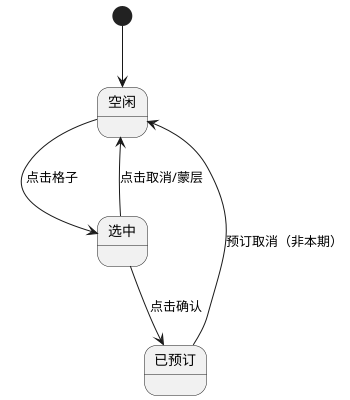
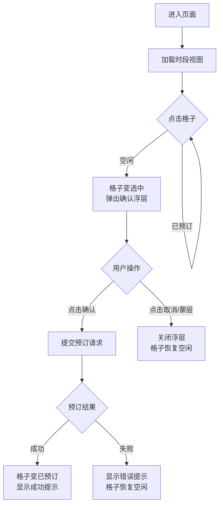

# 会议室预订｜快订 H5 页面

**变更记录**

| 日期 | 变更人 | 版本 | 变更内容 |
|------|--------|------|----------|
| 20260416 | AI 生成 | V1.0 | 初始版本 |

---

## 一、背景与目标

### 1.1 现状问题

公司内部会议室预订流程繁琐，需要：打开钉钉 → 工作台 → 会议室 → 选择时间 → 查看可用会议室 → 填写预订信息 → 等待审批。整个流程步骤多、耗时长，用户体验不佳。

### 1.2 需求目标

简化预订流程，实现"快订"体验：
* 可视化时段网格，一目了然查看空闲状态
* 点击空闲时段直接预订，无需填写表单
* 预订成功率高，减少操作流失

---

## 二、产品方案

### 2.1 需求优先级

| 序号 | 需求 | 干系域 | 优先级 |
|------|------|--------|--------|
| 1 | 时段视图展示 | 前端 | P0 |
| 2 | 快订流程 | 前端+后端 | P0 |
| 3 | 预订确认浮层 | 前端 | P0 |
| 4 | 埋点数据上报 | 前端+数据 | P1 |

### 2.2 功能模块

#### 模块一：时段视图

展示 5 个会议室横排，纵向 16 个时段（08:00-24:00），每个格子显示状态。

> 📷 **图片占位**：Demo 页面截图 - 主界面时段视图，展示 5 个会议室×16 个时段
>
> - 位置：demo.html 主界面（#main-view）
> - 操作：需截图

**格子状态**

会议室格子有 3 种状态：

| 状态 | 样式 | 说明 |
|------|------|------|
| 空闲 | 绿色背景 | 可点击预订 |
| 已预订 | 红色背景 | 不可点击 |
| 选中 | 蓝色背景 | 当前选中待确认 |

> 📷 **图片占位**：多状态对比图 - 格子三状态对比（空闲/选中/已预订）
>
> - 位置：从 demo.html 分别截取 .time-slot 的 free/selected/booked 三种状态
> - 操作：需截图后拼接为对比图

**交互规范**

* 默认展示当天时段视图，时间范围为 08:00-24:00
* 点击空闲格子，格子切换为选中状态，同时弹出预订确认浮层
* 点击已预订格子，无响应
* 点击蒙层或「取消」按钮，关闭浮层，格子恢复空闲状态

#### 模块二：预订确认浮层

点击空闲格子后弹出，展示预订信息并引导确认。

> 📷 **图片占位**：Demo 页面截图 - 预订确认浮层
>
> - 位置：demo.html 中 #booking-modal
> - 操作：需截图

**浮层内容**

* 标题：「确认预订」
* 会议室名称：#{会议室名称}
* 时间：今天 #{时段起止}
* 行动点：
    * 主按钮：「确认」，点击后提交预订请求
    * 次按钮：「取消」，点击后关闭浮层，格子恢复空闲状态

**交互规范**

* 浮层默认居中展示，带半透明蒙层
* 点击蒙层，关闭浮层，格子恢复空闲状态
* 点击「确认」后，浮层关闭，格子切换为已预订状态，显示成功提示
* 如预订失败（网络异常/接口超时/会议室已被占），显示错误提示，格子恢复空闲状态

#### 模块三：预订成功状态

预订成功后显示成功提示：

* 显示「预订成功！」文案
* 2s 后自动消失（时间可配）

### 2.3 状态流转

格子状态流转如下：

### 2.4 业务流程

快订流程如下：

---

## 三、数据度量

### 3.1 埋点清单

| 事件 | 触发时机 | 关键参数 |
|------|---------|---------|
| view_time_grid | 时段视图曝光 | room_count, time_slot_count |
| click_time_slot | 点击格子 | room_id, time_slot, status |
| click_confirm | 点击确认按钮 | room_id, time_slot |
| booking_success | 预订成功 | room_id, time_slot, booking_id |

### 3.2 核心指标

| 指标 | 定义 | 口径 |
|------|------|------|
| 时段视图曝光 UV | 进入页面的用户数 | view_time_grid 去重用户 |
| 格子点击率 | 点击格子占曝光的比例 | click_time_slot uv / view_time_grid uv |
| 预订转化率 | 点击确认占点击格子的比例 | click_confirm uv / click_time_slot uv |

> 📷 **图片占位**：数据报表截图 - 埋点指标定义
>
> - 位置：待标注数据来源（如埋点管理平台）
> - 操作：需标注来源

---

## 四、配置化设计

| 配置项 | 默认值 | 配置入口 | 说明 |
|--------|--------|----------|------|
| 成功提示持续时间 | 2s | 服务端下发 | 预订成功后提示自动消失时间 |
| 时段起始时间 | 08:00 | 服务端下发 | 时段视图显示的起始时间 |
| 时段结束时间 | 24:00 | 服务端下发 | 时段视图显示的结束时间 |
| 会议室数量 | 5 | 服务端下发 | 时段视图展示的会议室数量 |

---

## 五、干系人与分工

| 干系域 | 接口人 | 职责 |
|--------|--------|------|
| 前端 | 待定 | H5 页面开发：时段视图、交互组件、埋点上报 |
| 后端 | 待定 | 预订接口开发：查询可用时段、提交预订 |
| 设计 | 待定 | 视觉定稿：配色、间距、图标确认 |
| 数据 | 待定 | 埋点配置、数据回收、效果分析 |

---

## 六、依赖与待定问题

### 6.1 依赖

| 依赖方 | 依赖内容 | 状态 |
|--------|---------|------|
| 钉钉 | 免登能力 | 待确认 |
| 会议室服务 | 查询可用时段接口 | 待确认 |
| 预订服务 | 提交预订接口 | 待确认 |

### 6.2 待定问题

| 问题 | 负责人 | 状态 |
|------|--------|------|
| 时段视图是否支持跨天预订？ | 产品 | 待确认 |
| 预订失败时的错误提示文案？ | 产品 | 待确认 |
| 是否需要支持批量预订？ | 产品 | 非本期 |

---

## 七、验收标准

| 场景 | 预期结果 |
|------|---------|
| 进入页面 | 正确展示 5 个会议室×16 个时段，空闲格子绿色，已预订格子红色 |
| 点击空闲格子 | 格子变蓝色，弹出确认浮层 |
| 点击取消/蒙层 | 浮层关闭，格子恢复绿色 |
| 点击确认 | 浮层关闭，格子变红色，显示成功提示 |
| 点击已预订格子 | 无响应 |