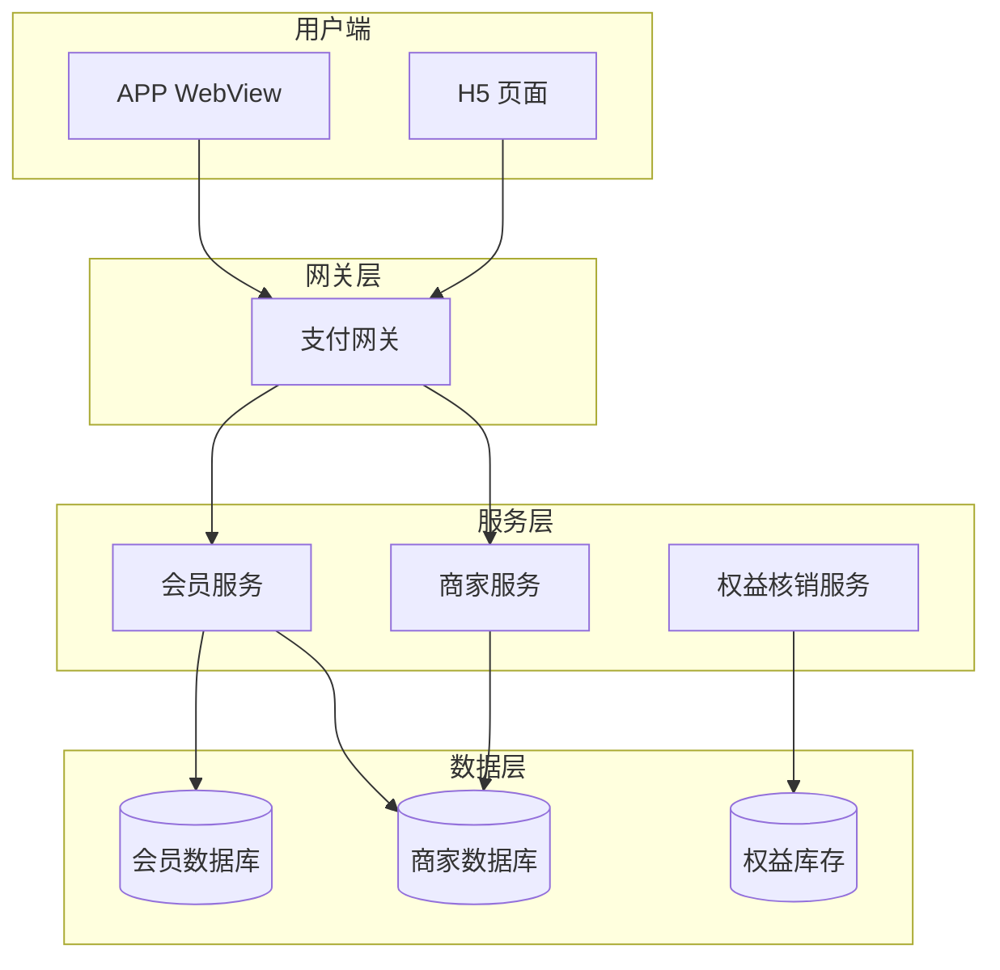
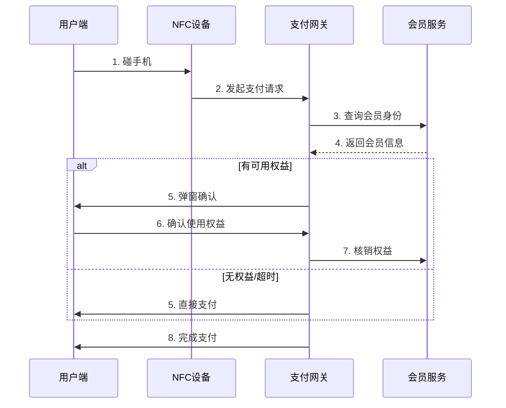

# 支付｜NFC会员识别功能

## 变更记录

| 日期 | 变更人 | 版本 | 变更内容 |
|------|--------|------|----------|
| 20260412 | AI 生成 | V1.0 | 初始版本 |

---

## 一、需求概述

### 1.1 业务背景与问题定位

当前NFC支付场景中，用户在商家处碰手机完成支付后，会员身份需要单独出示会员码，体验断裂。数据显示，约 65% 的会员用户在NFC支付时未出示会员身份，导致商家无法识别会员、用户无法享受会员权益。

核心问题：支付链路与会员识别割裂，用户需额外操作才能享受会员权益。

### 1.2 目标价值

**定量目标**：
- 会员权益使用率：12%→30%（+18pt）
- 会员识别成功率：≥95%

### 1.3 目标人群

| 角色 | 描述 |
|------|------|
| 用户 | 已开通商家会员的NFC支付用户 |
| 商家 | 接入NFC支付的品牌商家（约 1.2 万家门店） |

---

## 二、产品方案概述

### 2.1 产品架构图

展示系统各组件的层次结构和静态依赖关系。

### 2.2 业务流程图

展示业务从触发到完成的完整步骤和各角色分工。

### 2.3 需求范围与功能清单

| 序号 | 需求 | 优先级 |
|------|------|--------|
| 1 | 会员识别页（H5） | P0 |
| 2 | 权益确认弹窗-优惠券类型 | P0 |
| 3 | 权益确认弹窗-积分抵扣类型 | P0 |
| 4 | 权益确认弹窗-非会员类型 | P0 |
| 5 | 会员识别正常链路 | P0 |
| 6 | 异常链路-服务超时 | P0 |
| 7 | 异常链路-非会员 | P0 |
| 8 | 异常链路-权益核销失败 | P0 |
| 9 | 配置化接口 | P0 |
| 10 | 非会员开通入口 | P1 |
| 11 | 降级状态展示 | P1 |
| 12 | AB 实验 | P1 |

### 2.4 范围排除

- 本期不做跨商家会员识别（仅支持单商家维度）
- 本期不做会员等级变更提醒
- 本期不做积分兑换商品（仅支持积分抵扣现金）
- 本期不做会员信息修改入口

### 2.5 产品原型示例

> ⚠️ 此处需补充：Demo 截图（从 index.html 截取会员识别页、弹窗、降级状态的多状态对比）

---

## 三、需求描述

### 3.1 会员识别页

位于支付准备页顶部，展示会员识别进度和结果。

**顶部状态栏**：
* 展示会员识别进度（识别中 → 已识别 → 权益匹配）
* 进度条展示识别各阶段状态
* 识别完成后展示识别结果文案

**会员信息区**：
* 展示会员等级（如「金卡会员」）
* 展示积分余额（如「积分: 2,580」）
* 展示会员等级标识（如 Lv.3）
* 如用户非该商家会员，展示「一键开通」入口
* 如会员信息获取超时（3s），展示降级文案「会员信息获取中，不影响支付」

**权益推荐区**：
* 根据订单金额匹配可用权益
* 有可用优惠券：展示最优券面额和使用条件
* 有积分抵扣：展示可抵扣金额（具体设计以视觉稿为准）
* 无可用权益：不展示此区域

### 3.2 权益确认弹窗

支付前弹窗确认权益使用，分为三种类型：

**类型 1 - 有优惠券弹窗**：
* 全局弹窗，交互遵循客户端现有规范
* 主文案：本单可使用会员优惠，独立一行
* 副文案：已为您匹配 #{券面额} 元优惠券，数字部分红色放大加粗
* 行动点：
    * 主按钮：「使用优惠并支付」，点击后自动核销优惠券并推进支付流程
    * 次按钮：「不使用，直接支付」，点击后跳过权益直接进入支付流程

**类型 2 - 仅积分抵扣弹窗**：
* 全局弹窗，交互遵循客户端现有规范
* 主文案：本单可用积分抵扣，独立一行
* 副文案：#{可用积分} 积分可抵 #{抵扣金额} 元，数字部分红色放大加粗
* 行动点：
    * 主按钮：「使用积分并支付」，点击后核销积分并推进支付流程
    * 次按钮：「不使用，直接支付」，点击后跳过权益直接进入支付流程

**类型 3 - 非会员弹窗**：
* 全局弹窗，交互遵循客户端现有规范
* 主文案：开通会员享专属优惠，独立一行
* 副文案：本单预计可省 #{预估金额} 元，数字部分红色放大加粗
* 行动点：
    * 主按钮：「开通并支付」，点击后先跳转会员开通页，开通成功后推进支付流程
    * 次按钮：「跳过，直接支付」，点击后跳过开通直接进入支付流程

### 3.3 会员识别链路

#### 正常链路

* 用户侧：碰手机后进入支付准备页，同时发起会员识别请求
* 设备侧：感应成功后，将用户 uid 和商家 pid 透传给会员服务
* 服务端：收到 uid+pid，查询会员关系，3s 内返回会员信息和可用权益
    * 如有可用权益，推送权益信息给客户端，弹出权益确认弹窗
    * 如无可用权益，静默跳过，直接进入支付流程

#### 异常链路 1 - 会员服务超时

* 服务端：3s 内未返回结果（3s 超时时间可配）
* 用户侧：展示降级文案「会员信息获取中，不影响支付」，支付流程不阻塞，会员权益在支付成功后异步补发
* 设备侧：正常推进支付，不等待会员结果

#### 异常链路 2 - 会员关系不存在

* 服务端：查询结果为非会员
* 用户侧：根据商家配置决定是否展示「一键开通」入口
    * 商家配置开启：展示开通入口
    * 商家配置关闭：不展示开通入口

#### 异常链路 3 - 权益核销失败

* 服务端：优惠券/积分核销接口返回失败
* 用户侧：toast 提示「权益使用失败，已为您完成支付」，支付金额回退为原价
* 后续：记录核销失败日志，T+1 人工排查

### 3.4 配置化设计

商家可在运营后台配置：

| 配置项 | 类型 | 默认值 | 说明 |
|--------|------|--------|------|
| enableMemberRecognition | boolean | false | 是否开启NFC会员识别 |
| timeoutMs | number | 3000 | 会员识别超时时间（毫秒） |
| showJoinEntry | boolean | true | 非会员是否展示开通入口 |
| benefitPriority | string[] | ['coupon', 'points'] | 权益优先级顺序 |

---

## 四、非功能性需求

### 4.1 配置化字段

见 3.4 配置化设计表格。

### 4.2 性能要求

| 指标 | 要求 |
|------|------|
| NFC 感应到发起会员识别 | ≤800ms |
| 会员识别超时时间 | 默认 3s，可配置 1-5s |

### 4.3 兼容性说明

* 部分老设备（N3/N3C）不支持透传 uid，需降级为手动出示会员码
* 客户端版本低于 X.X.X 时，不展示会员识别功能

---

## 五、数据度量与实验

### 5.1 指标分层体系

**核心指标**：
| 指标 | 定义 | 目标值 |
|------|------|--------|
| 会员权益使用率 | 使用了会员权益的支付笔数 / 有会员身份的NFC支付总笔数 | 12%→30%（+18pt） |

**过程指标**：
| 指标 | 定义 | 口径 |
|------|------|------|
| 会员识别成功率 | 3s内成功返回会员信息的请求数 / 总识别请求数 | ≥95% |
| 权益匹配率 | 匹配到可用权益的会员支付笔数 / 会员支付总笔数 | — |

**基础指标**：
* 会员识别请求 pv/uv
* 权益确认弹窗曝光率
* 弹窗「使用优惠并支付」点击率
* 「不使用，直接支付」点击率
* 非会员「开通并支付」转化率

**分析指标**：
* 识别超时率 = 超时请求数 / 总识别请求数
* 权益核销失败率 = 核销失败笔数 / 尝试核销笔数
* 会员开通转化率 = 通过弹窗开通会员的用户数 / 非会员弹窗曝光用户数

### 5.2 AB 实验设计

| 组别 | 样本 | 方案 |
|------|------|------|
| 实验组 A | 4000w | NFC自动识别会员 + 权益弹窗 |
| 实验组 B | 4000w | NFC自动识别会员 + 静默使用最优权益（不弹窗） |
| 对照组 | 4000w | 当前链路，需手动出示会员码 |

* 实验周期：14 天
* 核心观测：权益使用率、支付成功率、单笔支付时长

### 5.3 埋点清单

| 事件 | 触发时机 | 关键参数 |
|------|---------|----------|
| member_recognize_expose | 会员识别页曝光 | uid, merchantId, isMember |
| member_recognize_success | 会员识别成功 | uid, memberLevel, availableBenefits |
| member_recognize_timeout | 会员识别超时 | uid, timeoutDuration |
| benefit_dialog_expose | 权益确认弹窗曝光 | uid, benefitType, benefitAmount |
| benefit_use_click | 点击使用权益 | uid, benefitType, benefitId |
| benefit_skip_click | 点击跳过权益 | uid, benefitType |
| benefit_writeoff_fail | 权益核销失败 | uid, benefitType, failReason |

---

## 六、风险与应对

| 视角 | 风险 | 应对 |
|------|------|------|
| 用户 | 会员识别耗时影响支付体验 | 3s 超时后降级，不阻塞支付流程 |
| 商家 | 权益核销失败导致资金损失 | 记录失败日志，T+1 人工排查，支付金额回退原价 |
| 平台 | 会员服务 QPS 峰值压力 | 提前评估扩容，必要时限流降级 |
| 监管 | 会员权益展示合规性 | 仅展示优惠券、积分抵扣等常规权益 |

---

## 七、干系人与分工

| 干系域 | 职责 |
|--------|------|
| 前端 | H5页面开发：会员识别页、弹窗组件、交互逻辑、埋点上报 |
| 后端 | 接口开发：会员识别、权益核销、配置下发、埋点数据落库 |
| 客户端 | 纯 WebView 承载，无 Native 依赖 |
| 设计 | 视觉定稿：配色、间距、图标确认，多状态视觉 |
| 数据 | 实验分组、数据回收、效果分析 |

---

## 八、依赖与待定问题

| 问题 | 状态 | 说明 |
|------|------|------|
| 非会员开通入口是否所有商家都开放 | 待确认 | 需产品决策后确定配置化逻辑 |
| 会员服务 QPS 扩容评估 | 待评估 | 需技术评估后确定方案 |
| 老设备降级策略 | 待确认 | 需客户端配合确定版本判断逻辑 |

---

## 九、演进规划

| 版本 | 内容 |
|------|------|
| v1.0（本期） | 基础会员识别：单商家维度、弹窗确认、3种异常链路 |
| v2.0 | 个性化权益推荐：基于用户历史行为推荐最优权益 |
| v3.0 | 跨商家会员识别：用户授权后跨商家识别会员身份 |